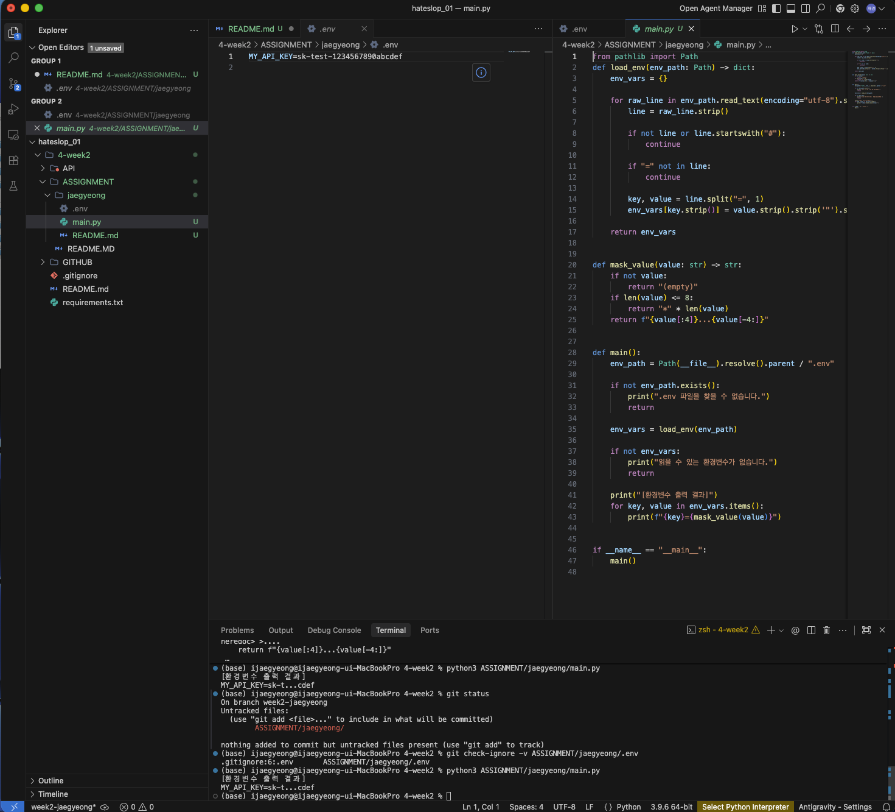

# week2 과제 - jaegyeong

## 안녕하세요
이번 주차 과제를 통해 `.env` 파일로 환경변수를 분리해서 관리하는 방법과,
파이썬에서 이를 읽어오는 방식을 연습했습니다.

## 학습한 내용
- 민감한 정보(API 키)는 코드에 직접 쓰지 않고 `.env` 파일로 분리할 수 있다.
- `.env` 파일은 `.gitignore`에 등록해서 GitHub에 올라가지 않도록 관리해야 한다.
- 환경변수를 출력할 때는 값을 그대로 노출하지 않고 일부를 마스킹해서 보여주는 것이 안전하다.

## 실행 방법
```bash
python3 ASSIGNMENT/jaegyeong/main.py

